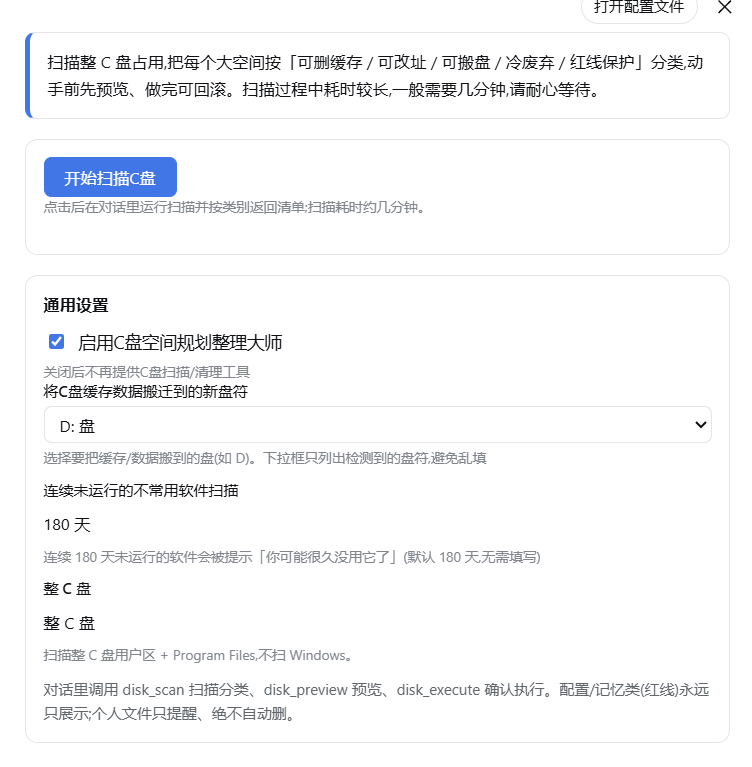
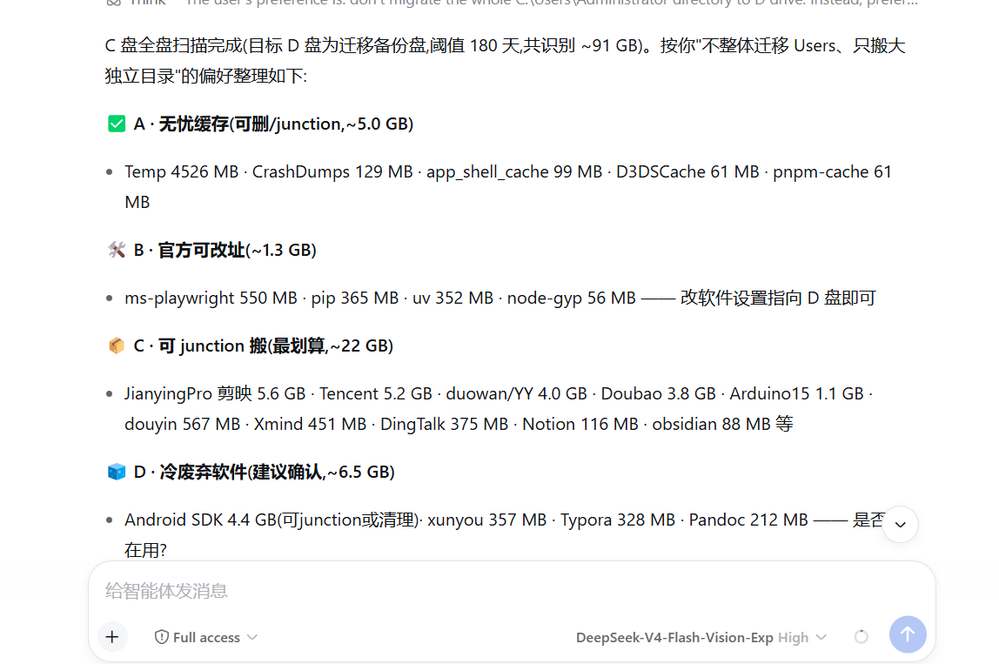
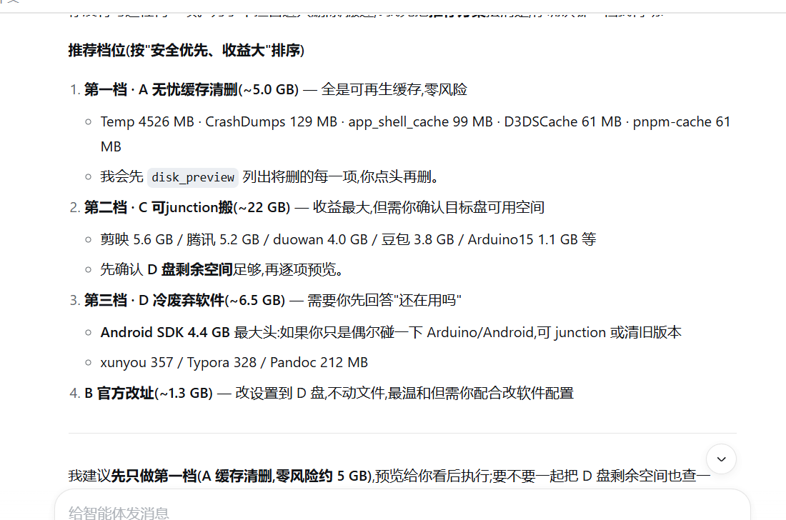

# dsh-disk-manager · C盘空间规划整理大师

> 一个 **DSH（DeepSeek Harness）Web UI 插件**，把 C 盘占用分门别类，针对每类给出**不同的正确动作**（删缓存 / 引导改址 / junction 搬家 / 提示废弃 / 个人文件只提醒），而不是像传统清理工具那样只会删缓存。**配置/记忆类（红线）永不自动执行。**

<p align="center">
  
  <br/>
  <em>设置页:一句话总结 + 「开始扫描C盘」按钮 + 通用设置</em>
</p>

<p align="center">
  
  <br/>
  
</p>

## 定位

现有磁盘清理工具普遍只做一件事：**删缓存**。但你真正的问题往往是：
1. **软件忘了删**（很久没用的大软件还霸着 C 盘）；
2. **数据放错了盘**（Docker 的 WSL、大缓存本来都可以搬到 D 盘）；
3. 缓存可再生但**清一次就长回来**。

`C盘空间规划整理大师` 是**统筹型参谋**:扫描整 C 盘 → 把每个大户分门别类 → 针对不同类别给不同动作 → 你点选确认后才执行。

## 扫描范围

整 C 盘(页面统一显示),**对内扫**:用户区 `AppData`(Local+Roaming) + 整个用户 profile(Downloads/Documents/Desktop 等) + `Program Files`;**不扫 Windows**(系统目录,扫了全是红线刷屏)。

## 六类模型（核心）

| 类别 | 含义 | 动作 | 风险 |
|---|---|---|---|
| **A 无忧缓存** | Cache/GPUCache/Code Cache/Temp/log/*.updater | 删 或 junction 搬 | 无(可再生) |
| **B 官方可改址** | Docker/npm/pnpm/pip/浏览器 profile | 走官方设置改到别的盘 | 低(官方支持) |
| **C 可junction搬** | 剪映/Notion/Trae/Cursor 等纯可再生缓存 | junction 搬到别的盘 | 低(可再生) |
| **D 冷废弃软件** | 大体积 + 超过 N 天(默认180)没用 | 提示「你可能很久没用它了」 | 只提示 |
| **E 配置/记忆(红线)** | Config/Storage/IndexedDB/MEMORY/.openviking/.qclaw | **只展示,绝不执行** | 高(绝不碰) |
| **P 个人文件** | Downloads/Documents/Desktop 等用户自己的数据 | 只提醒大文件,可手动搬,绝不自动删 | 高(用户数据) |

> **冷废弃(D)已修正误判**:已装软件(Docker、Typora、NVIDIA 等)的*安装目录*只在安装当天写一次 mtime,之后天天运行也不会更新,旧逻辑会按"lastAccess 超 180 天"误判成废弃。现在扫描时会快照一次运行中进程 + 命中 Docker/WSL 等常用白名单 → **在跑/常用的软件永不进入「冷废弃」**。

## 环境要求

- **Windows**(扫描与执行依赖 PowerShell;junction/删除用系统原生能力)。
- **Node.js** ≥ 22(DSH 运行时)。
- **DeepSeek Harness 0.1.7 ~ 0.2.x**(web profile,插件安装进 web 使用)。
  - **0.2 已实测可用**:本机在 `0.2.0-rc.1` 上完整跑通(host 工具 + 浏览器端设置页),`peerDependencies` 上界已随之从 `<0.2.0-0` 抬到 `<0.3.0-0`。
  - 设置页依赖 0.1.7 的客户端 `configForms` 契约;在更老的 DSH 上 host 侧工具照常可用,只是设置页不会出现。
- LLM 兜底(可选,不配也能用):走宿主 `ctx.llm.stream()`。模型路由优先取宿主的 **agent 默认模型**,取不到则用第一个可用 provider 的第一个模型;按项目规则**默认关闭推理**(`reasoningEffort:"off"`)。拿不到模型路由时,未知目录降级为"需人工确认",不影响扫描。

## 分类引擎:静态规则 + LLM 兜底 + 人工确认

不同电脑软件千差万别,不能靠死规则硬吃。分类引擎是**三级**:

1. **静态规则库 `core/riskmap.mjs`** —— 覆盖常见几十种软件/目录特征 + 扫描区(zone)判定,零成本、确定性。
2. **本地分类缓存** —— 用户确认过一次的分类写入 `~/.dsh-disk-manager/classify-cache.json`,下次同类直接命中,越用越聪明。
3. **LLM 兜底** —— 未命中的未知目录,打包特征(目录名/大小/子目录名)送 DSH 自带 LLM 判断类别,再让**用户确认**后才生效。

**强红线**:任何 `config/storage/indexeddb/memory/database/.openviking/.qclaw` 特征、以及所有点目录(`.xxx`),即使 LLM 判错,也会被回退为 E(只展示,不执行)。

## 架构速览

```
┌─────────────── client.js (Web 设置页, React.createElement 无构建) ───────────────┐
│  一句话总结 · 「开始扫描C盘」按钮 → remote.commands.execute("/disk_scan")           │
│    跑完把报告**直接渲染在本页**(对话里那条 command 节点是可折叠的,需点开看)        │
│  盘符下拉 ← GET /dsh-disk-manager/drives(真实盘符,不再硬编码)                    │
│  通用设置: 启用/目标盘/冷废弃天数/扫描范围 → configForms.get().set()               │
└───────────────────────────────┬──────────────────────────────────────────────────┘
                                │ host 端工具 + 斜杠命令 + 只读路由
┌───────────────────────────────▼──────────────────────────────────────────────────┐
│ index.mjs        工具注册(disk_scan/drives/preview/execute/classify/undo)        │
│                   + /disk_scan 命令(host 直跑,复用 runScan)                      │
│                   + /dsh-disk-manager/drives 只读路由(设置页盘符)                 │
│ config.mjs       配置(~/.dsh-disk-manager/config.json) + 分类缓存               │
│ core/                                                                           │
│   scanner.mjs    PowerShell 批量量体积 → {name,path,sizeMB,subdirs,lastAccess}   │
│   active.mjs     进程快照 + 常用白名单(修冷废弃误判)                             │
│   riskmap.mjs    静态规则库:目录名→A/B/C/D/E 特征映射                             │
│   classify.mjs   规则→缓存→LLM 三级分类(ctx.llm.stream,默认关推理)               │
│   safety.mjs     红线判定 + dry-run + undo                                        │
│   executor.mjs   删/junction/改址执行                                             │
└──────────────────────────────────────────────────────────────────────────────────┘
```

## 安全防线

- E 红线/程序本体/系统目录/点目录 **永远只展示**,无执行入口;
- P 个人文件**只提醒,绝不自动删**(仅允许手动 junction 搬);
- 执行前 `disk_preview` 生成 dry-run 预览;
- 可生成 undo 日志(`disk_undo` 查看);
- junction 迁移用原生 `New-Item -ItemType Junction`,已验证可回读。

## 工具(对话里驱动)

| 工具 | 作用 |
|---|---|
| `disk_drives` | 列出当前机器可用盘符(C/D/E...),供选择迁移目标盘 |
| `disk_scan` | 扫描整 C 盘,量体积,按 A/B/C/D/E/P 分组返回报告 |
| `disk_preview` | 对选中项 dry-run 预览(列出"将做什么") |
| `disk_execute` | 真正执行(删/junction/引导改址);E/未分类不执行,P 不可删 |
| `disk_classify_confirm` | 用户确认 LLM 判断的类别,写入本地缓存 |
| `disk_undo` | 查看 undo 日志,便于回滚 |
| `/disk_scan` | 斜杠命令:host 直跑扫描,不经模型;等价于 `disk_scan`,供设置页按钮调用 |

## 安装

```bash
dsh plugin --profile web add dsh-disk-manager
```

安装后**重启 DSH**。设置页出现「C盘空间规划整理大师」标签;点「开始扫描C盘」一键扫描,或在对话里直接运行 `/disk_scan` / 调用 `disk_scan` 工具。

> **版本要求:DSH 0.1.7 或更高。** 设置页依赖 0.1.7 的 `configForms` 契约;更老的 DSH 上工具仍可用,设置页不出现。

## 配置文件

`~/.dsh-disk-manager/config.json`,首次使用需在设置页或工具里选好**目标盘**。参考 [`config.example.json`](./config.example.json)。

## 目录结构

```
dsh-disk-manager/
├── package.json          # dsh.client.web 注入 + npm 元数据
├── index.mjs             # 主入口 + 工具注册 + /disk_scan 命令
├── client.js             # Web 设置页
├── config.mjs            # 用户配置 + 分类缓存读写
├── cordis.patch.yml
├── screenshots.json      # 注册表截图声明
├── assets/screenshots/   # 产品截图
└── core/
    ├── scanner.mjs       # 扫描引擎(PowerShell 后端)
    ├── active.mjs        # 进程在跑检测 + 常用软件白名单(修冷废弃误判)
    ├── riskmap.mjs       # 静态规则库(五类特征映射)
    ├── classify.mjs      # 分类引擎(规则→缓存→LLM)
    ├── safety.mjs        # 红线判定 + dry-run + undo
    └── executor.mjs      # 执行引擎(删/junction/改址)
```

## 开发

本包**不带**可独立运行的调试脚本(0.1.0 开发期的 `dev-run.mjs` / `dev-tool.mjs`
已清理,`.npmignore` 里仍保留对应条目)。本地联调按 link 安装 + 重启实例:

```bash
npm install                                   # 装自己的依赖(schemastery)
dsh plugin --profile web add link:<本目录>     # 或手工在 profile package.json 里加 link: 行 + bundles
# 改 client.js → 刷新页面即生效；改 index.mjs / core/* → 重启 dsh web
```

> 回归自测建议用**隔离实例**(独立 `DSH_HOME` + 另起端口的 `dsh web --no-open` + `node_modules` junction 复用线上),
> 这样不会打断正在使用的实例。设置页三项验收:分区渲染 / 选盘立即回显 / 「开始扫描C盘」跑完在面板里出报告。

## License

[MIT](./LICENSE)
